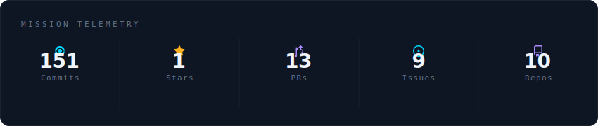
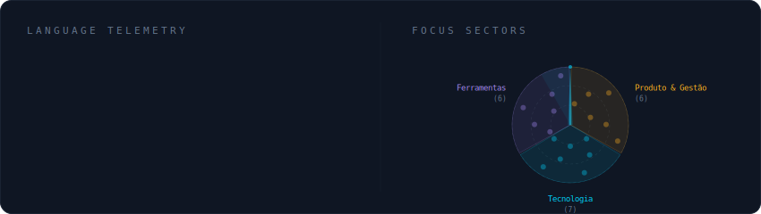

<!-- GALAXY HEADER -->
<div align="center">
  
</div>

---

<!-- ABOUT -->
<div align="center">

### 👋 Olá, eu sou o Stefan!

**Product Owner** em transição — com background em desenvolvimento de software e estágio na **Safran Cabin** (Airbus · Boeing · Embraer).

Conecto negócio, usuário e tecnologia para construir produtos que fazem sentido.  

[](https://www.linkedin.com/in/stefan-souza/)
[](https://github.com/Stefan0212)
[](https://fatec-jacarei-dsm-portfolio.github.io/ra2581392423024/)
[](mailto:stefancruz08@gmail.com)

</div>

---

<!-- MISSION TELEMETRY (GitHub Stats) -->
<div align="center">
  
</div>

---

<!-- TECH STACK -->
<div align="center">
  
</div>

---

<!-- PROJETOS -->
<div align="center">
  
</div>

---

<!-- EXPERIÊNCIA -->
## 🚀 Trajetória

```
🛰️  Safran Cabin          →  Document Control (Estágio)     Fev 2025 – Presente
                               Airbus · Boeing · Embraer

🎓  Fatec Jacareí        →  Desenvolvimento de Software     2024 – Presente
                               Multiplataforma (DSM)

🏆  WildFireExplore       →  Scrum Master                   2º Semestre
                               Melhor Projeto da Turma ⭐

🏆  Odin                  →  Dev Backend                    3º Semestre
                               Melhor Projeto da Turma ⭐
```

---

<!-- HABILIDADES -->
## 🧠 O que eu faço

### 🎯 Produto & Gestão


### 💻 Tecnologia


### 🛠️ Ferramentas


---

<!-- CERTIFICADOS -->
## 📜 Certificados

- 🎨 **Desenvolvedor Front-End** — Centro Paula Souza *(Set 2025)*  
  [🔗 Verificar certificado](https://siga.cps.sp.gov.br/cartorio/autenticador.aspx?28220403-9545-428b-9f81-2658706259cb)

---

<!-- FOOTER -->
<div align="center">

---

*"Bons produtos nascem de times que se comunicam bem — e é aí que meu background técnico faz diferença."*


</div>
